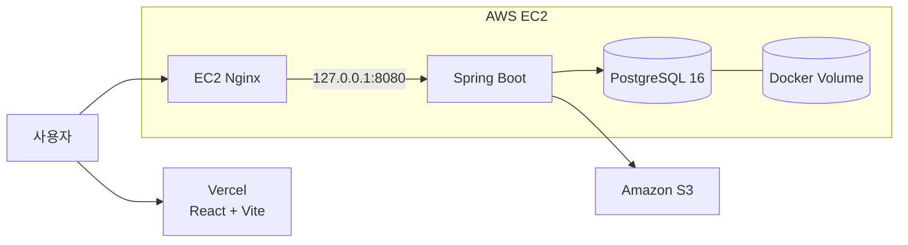

# FleaFlea Backend

친구들과 플리마켓을 열고, 도감에 등록한 물건을 거래할 수 있는 FleaFlea의 백엔드입니다.

## 서비스

- 프론트: [fleaflea.app](https://fleaflea.app), [www.fleaflea.app](https://www.fleaflea.app)
- API: [api.fleaflea.app](https://api.fleaflea.app)
- Swagger: [api.fleaflea.app/swagger-ui](https://api.fleaflea.app/swagger-ui/index.html)
- Health Check: [api.fleaflea.app/actuator/health](https://api.fleaflea.app/actuator/health)

## 구조



프론트는 Vercel, 백엔드는 AWS EC2에서 운영합니다.

외부 요청은 Nginx가 받은 뒤 Spring Boot 컨테이너로 전달합니다. Spring Boot와 PostgreSQL은 각각 `127.0.0.1:8080`, `127.0.0.1:5432`에만 열어두었습니다.

이미지는 S3에 저장하며 EC2 Instance Role로 접근합니다.

## 기술 스택

| 구분 | 사용 기술 |
|---|---|
| Backend | Java 25, Spring Boot 4.1.1 |
| Database | PostgreSQL 16 |
| ORM | Spring Data JPA, QueryDSL 7.6 |
| Migration | Flyway |
| Security | Spring Security, JWT |
| API Docs | Springdoc OpenAPI 3.1.0 |
| Storage | Amazon S3 |
| Infra | AWS EC2, Nginx, Docker Compose |
| CI/CD | GitHub Actions, GHCR, AWS SSM |

## 운영 서버

| 항목 | 설정 |
|---|---|
| OS | Ubuntu 24.04.4 LTS |
| Kernel | Linux 6.17.0-1017-aws |
| Memory | 약 2GB |
| Disk | 약 19GB |
| Nginx | 1.24.0, HTTP/2 |
| Java | Eclipse Temurin 25 |
| PostgreSQL | 16 |

애플리케이션 컨테이너는 메모리를 최대 1GB까지 사용합니다.

```text
JVM Heap: 256MB ~ 768MB
App:      127.0.0.1:8080
Database: 127.0.0.1:5432
```

## 배포

`main` 브랜치에 코드가 반영되면 자동 배포가 시작됩니다.

```text
GitHub Actions
  → Gradle Build / Test
  → Docker Image Build
  → GHCR Push
  → AWS SSM
  → Docker Compose 배포
  → Health Check
```

Docker 이미지는 커밋 SHA로 구분합니다.

```text
ghcr.io/hyundai-autoever-team3/fleaflea-backend:<commit-sha>
```

배포에 실패하면 이전 이미지로 롤백합니다. 정상 배포 후에는 7일 이상 지난 미사용 이미지를 정리합니다.

배포 설정은 [`deploy/ec2`](./deploy/ec2)에 있습니다.

## 데이터베이스

PostgreSQL 데이터는 `fleaflea_postgres_data` 볼륨에 저장합니다.

DB 변경은 Flyway로 관리합니다.

```text
src/main/resources/db/migration
```

이미 적용된 마이그레이션 파일은 수정하지 않습니다. 변경 사항이 생기면 새로운 버전 파일을 추가합니다.

```text
V17__change_description.sql
```

## 이미지

지원 형식:

- JPEG
- PNG
- WebP

파일 확장자 대신 실제 이미지 데이터를 읽어 형식을 확인합니다. 업로드한 이미지는 용도별 S3 경로에 저장합니다.

```text
profiles/
collection-items/
items/
markets/
```

## 알림

알림은 먼저 DB에 저장하고, SSE로 실시간 전송합니다.

```text
GET /api/v1/notifications/subscribe
```

SSE 연결이 끊겨도 저장된 알림은 목록 API에서 다시 확인할 수 있습니다.

## 서버 설정

운영 환경 변수는 서버에서 따로 관리합니다.

```text
/etc/fleaflea/
├── fleaflea.env
├── postgres.env
├── deploy.env
└── ghcr.env
```

비밀번호와 토큰은 저장소에 올리지 않습니다.

## 로컬 실행

`.env.example`을 복사합니다.

```powershell
Copy-Item .env.example .env
```

필요한 값을 입력한 뒤 실행합니다.

```powershell
.\gradlew.bat bootRun
```

테스트:

```powershell
.\gradlew.bat test
```

성능 측정 설정으로 실행:

```powershell
.\gradlew.bat bootRun -Pperf
```

## 주요 기능

- 회원가입 및 로그인
- 친구 요청과 친구 관리
- 플리마켓 생성 및 참여
- 도감 물건 관리
- 판매, 대여, 교환, 구걸
- 거래 요청 처리
- 실시간 알림
- S3 이미지 관리
- QueryDSL 검색 및 페이지 처리
