# FleaFlea Backend

친구끼리 플리마켓을 열고, 도감에 등록한 물건을 거래할 수 있는 **FleaFlea**의 백엔드 저장소입니다.

Spring Boot를 기반으로 API 서버를 구성했으며, Docker Compose를 이용해 애플리케이션과 PostgreSQL을 함께 운영하고 있습니다.
실제 서비스는 AWS EC2에 배포되어 있으며, Vercel에 배포된 프론트엔드와 HTTPS로 통신합니다.

---

## 1. 시스템 아키텍처

```mermaid
flowchart LR
    subgraph CLIENT ["Client"]
        User["User Browser<br/>(Web Client)"]
    end

    subgraph FRONTEND ["Frontend (Vercel)"]
        FE["React 18 + Vite<br/>flea-aaw6.vercel.app<br/>Global CDN / HTTPS"]
    end

    subgraph GATEWAY ["DNS & Network"]
        DNS["DuckDNS (DDNS)<br/>fleaflea.duckdns.org"]
        SG["AWS Security Group<br/>Inbound: 80, 443"]
    end

    subgraph EC2 ["AWS EC2 Host (Ubuntu 24.04 LTS)"]
        Nginx["Nginx 1.24+<br/>SSL Termination<br/>80 → 443 Redirect<br/>Proxy → 127.0.0.1:8080"]

        subgraph DOCKER ["Docker Compose"]
            App["Spring Boot<br/>Java 25 · Port 8080<br/>REST API / JWT"]
            DB[("PostgreSQL 16<br/>Port 5432<br/>Flyway")]
            Vol[("Named Volume<br/>fleaflea_postgres_data")]
        end
    end

    subgraph STORAGE ["Storage & CI/CD"]
        S3[("Amazon S3<br/>Image Storage")]
        CI["GitHub Actions<br/>GHCR Build & SSM Deploy"]
    end

    User -->|"Web Access"| FE
    User -.->|"Swagger Access"| DNS

    FE ==>|"REST API · HTTPS"| DNS
    DNS --> SG
    SG -->|"443"| Nginx

    Nginx ==>|"Proxy · 8080"| App
    App <==>|"JDBC · 5432"| DB
    DB --- Vol
    App -.->|"AWS SDK"| S3

    CI -.->|"Automated Deploy"| DOCKER

    classDef clientBox fill:#f0f9ff,stroke:#0284c7,stroke-width:2px,color:#0f172a;
    classDef feBox fill:#fdf4ff,stroke:#a855f7,stroke-width:2px,color:#0f172a;
    classDef gwBox fill:#ecfeff,stroke:#06b6d4,stroke-width:2px,color:#0f172a;
    classDef nginxBox fill:#f0fdf4,stroke:#16a34a,stroke-width:2px,color:#0f172a;
    classDef appBox fill:#f0fdf4,stroke:#22c55e,stroke-width:2px,color:#0f172a;
    classDef dbBox fill:#eff6ff,stroke:#2563eb,stroke-width:2px,color:#0f172a;
    classDef extBox fill:#fff7ed,stroke:#ea580c,stroke-width:2px,color:#0f172a;

    class User clientBox;
    class FE feBox;
    class DNS,SG gwBox;
    class Nginx nginxBox;
    class App appBox;
    class DB,Vol dbBox;
    class S3,CI extBox;

    style CLIENT fill:#ffffff,stroke:#94a3b8,stroke-width:1px,color:#334155
    style FRONTEND fill:#ffffff,stroke:#94a3b8,stroke-width:1px,color:#334155
    style GATEWAY fill:#ffffff,stroke:#94a3b8,stroke-width:1px,color:#334155
    style EC2 fill:#f8fafc,stroke:#64748b,stroke-width:2px,color:#0f172a
    style DOCKER fill:#ffffff,stroke:#94a3b8,stroke-width:1.5px,stroke-dasharray:4 4,color:#334155
    style STORAGE fill:#ffffff,stroke:#94a3b8,stroke-width:1px,color:#334155
```


## 2. 기술 스택

| 구분                       | 기술 / 도구                             | 버전 / 비고                      |
| :----------------------- | :---------------------------------- | :--------------------------- |
| **Language & Framework** | Java, Spring Boot                   | Java 25, Spring Boot 3.4.3   |
| **Database & ORM**       | PostgreSQL, Spring Data JPA, Flyway | PostgreSQL 16                |
| **Web Server & SSL**     | Nginx, Certbot                      | Nginx 1.24+, Let's Encrypt   |
| **Container**            | Docker, Docker Compose              | Bridge Network, Named Volume |
| **Cloud**                | AWS EC2, Amazon S3, DuckDNS         | Ubuntu 24.04 LTS             |
| **CI/CD**                | GitHub Actions, GHCR, AWS SSM       | Docker 이미지 기반 자동 배포          |
| **API Docs**             | Springdoc OpenAPI                   | Swagger UI                   |
| **Frontend**             | React 18, Vite, Vercel              | HTTPS 통신                     |
```

## 3. 구성 및 요청 흐름

### 3-1. Frontend

프론트엔드는 React와 Vite로 구성되어 있으며 Vercel을 통해 배포하고 있습니다.

사용자가 Vercel에 배포된 웹 페이지에 접속하면 브라우저에서 백엔드 API 도메인인 `fleaflea.duckdns.org`로 요청을 보냅니다.

프론트엔드와 백엔드 간 통신은 HTTPS 기반의 REST API 방식으로 이루어집니다.

### 3-2. DNS / Nginx

백엔드 서버는 AWS EC2에서 운영하고 있으며, DuckDNS를 이용해 EC2 IP와 도메인을 연결했습니다.

```text
fleaflea.duckdns.org
        ↓
AWS EC2
        ↓
Nginx
        ↓
Spring Boot
```

AWS Security Group에서는 외부에 `80`, `443` 포트만 열어두고 있습니다.

Nginx는 외부 요청을 가장 먼저 받아 다음 역할을 수행합니다.

* HTTP 요청을 HTTPS로 리다이렉트
* Let's Encrypt 인증서를 이용한 HTTPS 처리
* `/` 요청을 Spring Boot의 `127.0.0.1:8080`으로 전달
* 외부에서 Spring Boot의 8080 포트에 직접 접근하지 못하도록 구성

HTTP로 들어온 요청은 HTTPS로 자동 전환됩니다.

```text
http://fleaflea.duckdns.org
        ↓
https://fleaflea.duckdns.org
```

### 3-3. Docker Compose

EC2 내부에서는 Docker Compose를 이용해 Spring Boot와 PostgreSQL을 실행하고 있습니다.

#### fleaflea-app

Spring Boot 애플리케이션 컨테이너입니다.

주요 역할은 다음과 같습니다.

* JWT 기반 회원 인증
* 플리마켓 생성 및 관리
* 플리마켓 회원 관리
* 도감 아이템 관리
* 거래 요청 처리
* 이미지 업로드
* REST API 제공

컨테이너의 8080 포트는 EC2의 `127.0.0.1:8080`에 연결되어 있어 Nginx를 통해서만 외부 요청을 받을 수 있습니다.

CORS 설정에서는 Vercel 배포 주소와 로컬 개발 환경을 허용하고 있습니다.

#### fleaflea-postgres

서비스의 데이터를 저장하는 PostgreSQL 16 컨테이너입니다.

Spring Boot와 PostgreSQL은 Docker 내부 네트워크를 통해 통신합니다.

```text
fleaflea-app
     ↓
fleaflea-postgres:5432
```

PostgreSQL 데이터는 Docker Named Volume에 저장합니다.

```text
fleaflea_postgres_data
```

따라서 PostgreSQL 컨테이너가 재생성되더라도 기존 데이터는 유지됩니다.

데이터베이스 스키마는 Flyway를 이용해 관리하고 있으며, 애플리케이션 실행 시 필요한 마이그레이션이 자동으로 적용됩니다.

---

## 4. 이미지 저장

서비스에서 사용하는 이미지는 Amazon S3에 저장합니다.

현재 다음과 같은 이미지가 S3에 저장됩니다.

* 회원 프로필 이미지
* 플리마켓 이미지
* 도감 아이템 이미지

Spring Boot 애플리케이션에서 AWS SDK를 이용해 S3에 접근합니다.

AWS Access Key를 서버에 직접 저장하는 방식 대신 EC2에 IAM Role을 연결해 S3 접근 권한을 부여했습니다.

```text
Spring Boot
     ↓
EC2 IAM Role
     ↓
Amazon S3
```

이를 통해 애플리케이션에서 별도의 장기 AWS Access Key를 관리하지 않아도 S3를 사용할 수 있도록 구성했습니다.

---

## 5. CI/CD

백엔드 배포는 GitHub Actions를 이용해 자동화했습니다.

`main` 브랜치에 코드가 반영되면 다음 순서로 배포가 진행됩니다.

```text
main branch
     ↓
GitHub Actions
     ↓
Gradle Build / Test
     ↓
Docker Image Build
     ↓
GHCR Push
     ↓
AWS SSM
     ↓
EC2 deploy.sh 실행
     ↓
Docker Container 교체
     ↓
Health Check
```

GitHub Actions에서 Spring Boot 애플리케이션을 빌드한 뒤 Docker 이미지를 생성하고 GHCR에 업로드합니다.

이후 AWS Systems Manager의 `send-command`를 사용해 EC2의 배포 스크립트를 원격으로 실행합니다.

EC2에서는 새 이미지를 내려받은 후 기존 애플리케이션 컨테이너를 교체합니다.

배포 완료 후에는 Spring Boot Actuator를 이용해 서버 상태를 확인합니다.

```text
/actuator/health
```

정상적으로 배포된 경우 다음과 같이 `UP` 상태를 반환합니다.

```json
{
  "status": "UP"
}
```

---

## 6. 서버 환경 변수

EC2에서는 애플리케이션 설정과 계정 정보를 코드와 분리해 `/etc/fleaflea` 디렉토리에서 관리하고 있습니다.

```text
/etc/fleaflea/
├── fleaflea.env
├── postgres.env
├── deploy.env
└── ghcr.env
```

각 파일의 역할은 다음과 같습니다.

| 파일             | 용도                                     |
| :------------- | :------------------------------------- |
| `fleaflea.env` | Spring Boot 환경 변수, JWT Secret, S3 설정 등 |
| `postgres.env` | PostgreSQL DB 이름 및 계정 정보               |
| `deploy.env`   | 현재 배포할 Docker 이미지 정보                   |
| `ghcr.env`     | Private GHCR 이미지 Pull을 위한 인증 정보        |

민감한 값은 Git 저장소에 포함하지 않고 서버 환경에서 별도로 관리합니다.

---

## 7. API 문서

백엔드 API는 Springdoc OpenAPI를 이용해 문서화하고 있습니다.

배포된 서버의 Swagger UI에서 현재 제공하는 API를 직접 확인하고 테스트할 수 있습니다.

**Swagger UI**

https://fleaflea.duckdns.org/swagger-ui/index.html
